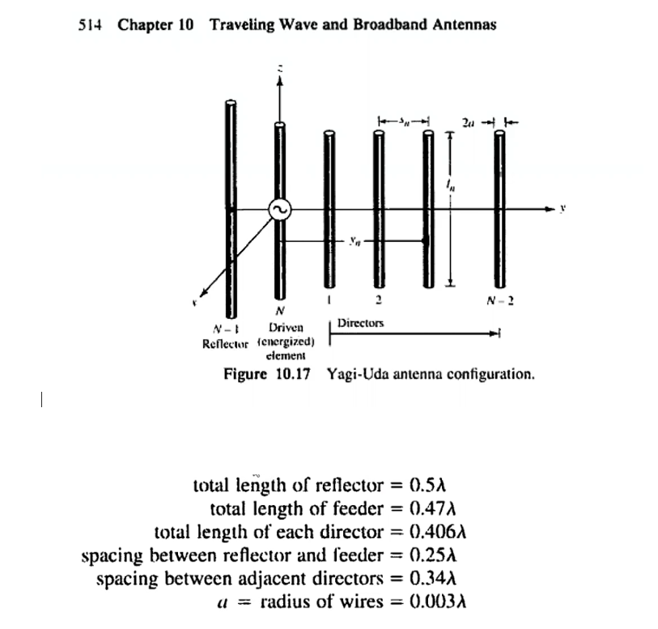

# RF-Yagi-Antenna
## Intro  
A Yagi–Uda antenna, commonly known as a Yagi antenna, is a directional antenna consisting of multiple parallel elements in a line, usually half-wave dipoles made of metal rods.Yagi–Uda antennas consist of a single driven element connected to the transmitter or receiver with a transmission line, and additional "parasitic elements" which are not connected to the transmitter or receiver: a so-called reflector and one or more directors.It was invented in 1926 by Shintaro Uda of Tohoku Imperial University, Japan, with a lesser role played by his colleague Hidetsugu Yagi. (Wikipedia)

## Goal
Design a Yagi antenna with 10 DBi Gain at frequency 1800 Mhz. 
make use of CST Studio Suite , and comparethe result with a realalistic one you have build.

## Solution:
Using CST Studio Suite,
first design the feeder, for that calculate Lambda for the given frequency -Lambda=c/f 
to calculate the accurate length of each  להמשיך פה!!!

I have used this book:
"Antenna Theory Analysis and Design Cropped fixed Constantine A Balanis 2nd Ed John Will"
to understand the distance between the reflector,feeder and director.

